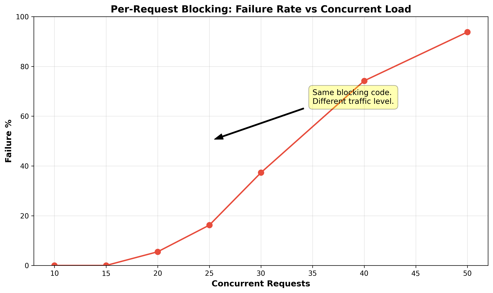
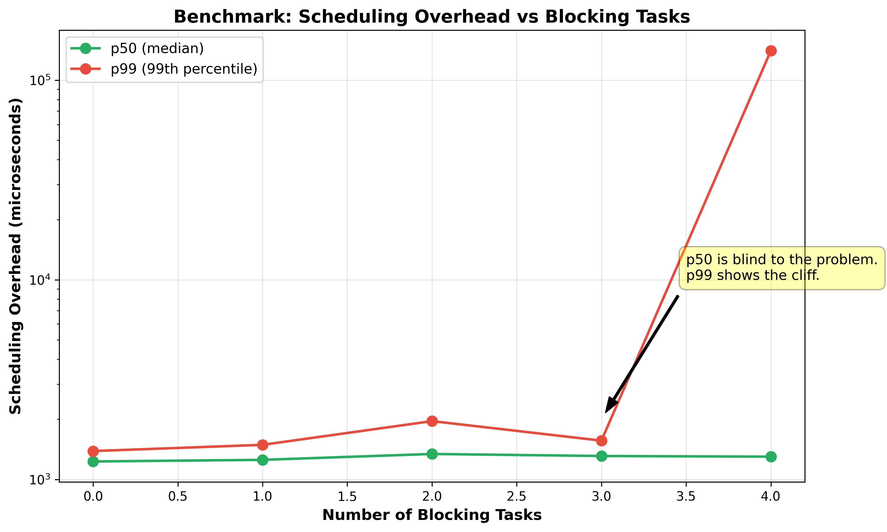
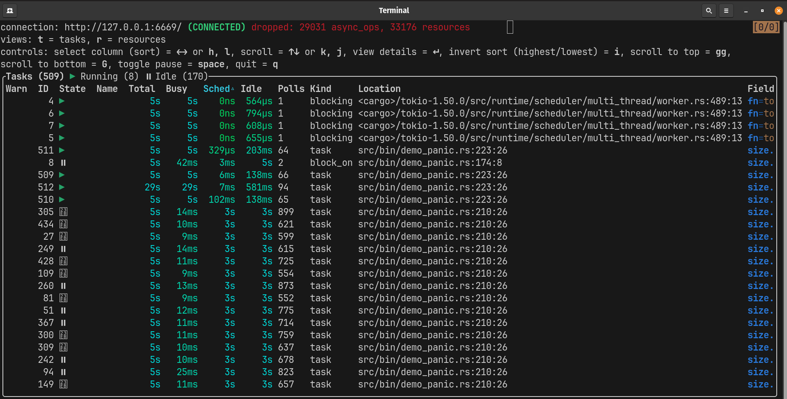
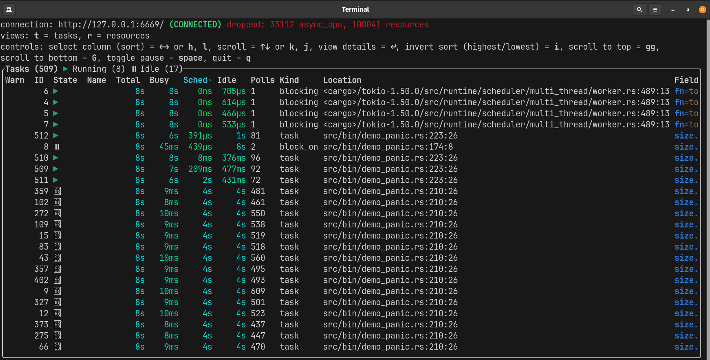

# Executor Starvation in Async Rust: The Hidden Cost of Blocking Code

## The Demonstration

### The panic that shouldn't happen

My async Rust library was designed to manage concurrent event streams for a high-speed hardware refurbishment pipeline. In isolation, the library performed flawlessly. It handled multiple sources and coordinated state through mutex-protected caches without a hitch. However, the moment I integrated it into the primary codebase, the runtime collapsed.

The failure was catastrophic and silent. There were no stack traces and no error messages. This was Rust, a language I associated with explicit failures and strong diagnostics, failing with zero guidance. I questioned my async logic, but the integration points were identical to other working services.

I felt betrayed by the guarantees I was accustomed to. Rust had trained me to expect that catastrophic failures would come from something obviously wrong. Instead, the cause turned out to be code that was completely valid, completely familiar, and disastrously misplaced.

The answer was not in my new code but in a legacy blocking call buried in the main codebase. This synchronous bottleneck had existed for months without issue because previous workloads never pushed the runtime hard enough. My library, with its heavy concurrent processing, finally pushed the worker pool to its saturation point.

This article explores the diagnostic vacuum I faced and the three-line architectural fix that restored the runtime.

### Understanding the crash

To diagnose why my library triggered a collapse while others remained stable, we must examine the relationship between hardware, OS threads,
and the Tokio runtime. Tokio operates on an M:N threading model, essentially a form of green threading, where many tasks are multiplexed onto a small number of worker threads. On a 4-vCPU machine, Tokio typically spawns four worker threads, each with its own local run queue and poll loop, designed to cycle through thousands of lightweight tasks.

In a healthy system, tasks act as good citizens. A task borrows a worker thread for a few microseconds to execute logic until it hits an `.await` point. At this yield point, the task suspends its state and the worker thread is liberated to poll other tasks, check for I/O readiness, or perform work-stealing from other queues. This massive multiplexing ratio is the source of Rust's high-performance concurrency, but it introduces a single, catastrophic point of failure: the contract of cooperation.

The runtime relies on the immutable assumption that tasks will yield frequently. If a task refuses to yield by executing synchronous blocking code, it does not merely slow down the system; it holds a worker thread hostage and paralyzes the engine that powers every concurrent operation in the runtime.

### From my specific case to the general problem

Once I understood that blocking code had caused the crash, I wanted to know whether this was a rare edge case or a systemic problem. The more I investigated, the more I realized that my experience was not unique. It was an instance of a general, non-obvious failure mode that affects any async service when blocking calls overlap.

Consider a production service built on this model.

The service handles incoming requests asynchronously across four worker threads.

Somewhere in the codebase, a synchronous function (a config fetch, a DNS lookup, a file read) sits in a code path that roughly 30% of requests traverse.

The function takes 50 milliseconds, completes successfully every time, and logs no errors.

At low traffic, these blocking calls rarely overlap and the worker pool absorbs them easily.

At higher traffic, multiple blocking calls land simultaneously, saturating the pool.

To reproduce these results, build and run the demo:

```bash
cargo build --release
./target/release/demo_per_request --run-all
```



The cliff lands between 15 and 20 concurrent requests. Zero failures at 15. Ninety-four percent at 50. This is not a stress test. It is the gap between manual testing and basic automated load testing.

### Why standard debugging fails

The blocking code completed successfully and logged zero errors. It never appears in failure traces. When you look at the logs, you see timeouts in your async handlers. Your natural conclusion is that the handlers are too slow. You begin optimizing the wrong code.

In reality, your handlers are victims. They are never being polled because the worker threads are occupied elsewhere. The source of the problem is the only thing that appears healthy.

The same saturation cliff appears under other triggers as well, including adding blocking work to a fixed workload or increasing async task count against fixed blocking; both are shown in the [additional demonstrations](ADDITIONAL_DEMOS.md).

---

## How Blocking Breaks the Poll Loop

### Why the compiler cannot catch this

The immediate objection is that blocking code should not exist inside an async context. Every Rust async tutorial says this. Tokio's documentation says this.

And yet it happens, because Rust's compiler, which catches data races, use-after-free, dangling references, and unhandled errors at compile time, has no mechanism to detect blocking inside async.

There is no trait bound that distinguishes a blocking function from a non-blocking function. There is no `#[must_not_block]` attribute in the language.

The following code compiles without any warning:

```rust
async fn fetch_config() -> Result<Vec<u8>, std::io::Error> {
    let bytes = std::fs::read("/etc/app/config.toml")?;
    Ok(bytes)
}
```

The function signature says `async fn`, so the compiler generates a state machine for it. But the body contains a blocking file read that will freeze the worker thread for the duration of the disk I/O.

A file read might return in 50 microseconds if the page is cached, or 5 milliseconds if it hits disk, or 500 milliseconds if the NFS server is slow. The compiler sees a function call that returns `Result<Vec<u8>, io::Error>` and has no way to know which of those scenarios will occur.

```rust
async fn verify_payload(input: &[u8]) -> bool {
    unsafe { ffi_crypto_lib::verify(input.as_ptr(), input.len()) }
}
```

This crosses the FFI boundary into foreign code that may block or burn CPU for the entire call. Tokio cannot preempt it, and the compiler has no basis to warn.

The compiler cannot distinguish this from legitimate CPU work that happens to take a long time. Static analysis cannot determine, in the general case, whether a function call will block. Blocking is a runtime property that depends on the kernel, the device, the network, and the current system load.

That creates a false sense of safety: if the code compiles, it feels safe, even when the executor semantics say otherwise.

### How blocking code enters async codebases

Blocking code slips into async codebases surprisingly easily, usually through several well-worn paths:

- Pre-async code: Utility functions that load config, parse static data, or read feature flags remain synchronous after a migration to async. They work correctly and are never rewritten.
- The standard library: std::fs, std::net, and std::thread are synchronous. A developer who reaches for these out of habit writes code that compiles without warning. Tokio provides async equivalents, but the compiler does not suggest them.
- Non-obvious blocking: println! to a slow stdout, serde_json::from_slice on large payloads, env::var under contention. These do not look like blocking I/O in code review.
- FFI calls: Any call across the FFI boundary is opaque to Rust's async runtime. A C function may block, burn CPU, or perform internal synchronization without yielding, and neither the compiler nor Tokio can reason about that behavior.
- Transitive dependencies: A crate three layers deep calls std::fs::metadata or reqwest::blocking::get. You never see it in your source code. It compiles, passes CI, and blocks in production.

Across all paths, the blocking code is correct. It produces the right output. The defect is not in what the code does, but in where it runs.

### The saturation threshold 

The point where blocking transitions from invisible to catastrophic.

At low concurrency, blocking calls rarely overlap. If one worker is blocked, the other three continue their poll loop, stealing tasks from the blocked worker's queue. The stolen tasks experience some additional latency, but the system stays within timeout thresholds. The service appears healthy.

The self-healing breaks when blocking calls overlap enough to saturate the worker pool. When the number of blocked workers equals the total worker count, there are zero free workers running the poll loop. No tasks are polled. No I/O events are checked. No work-stealing happens.

Even before total saturation, blocking steals polling capacity from the executor, so the runtime can no longer translate available hardware into the async throughput and latency that machine should be able to deliver.

This is a cliff, not a smooth degradation curve. [The demonstration](#the-demonstration) showed this empirically: zero failures at 15 concurrent requests, 94% at 50. Harmful tail-latency inflation begins before full saturation, but the sharp collapse appears when blocked workers approach the total worker count. At that point, the runtime loses most or all of its polling capacity, and starvation becomes visible as a system-wide failure rather than a localized slowdown.

This is also why executor starvation can turn into an "it works on my machine" bug. Tokio's multi-thread scheduler defaults to one worker thread per available CPU, so the same code can run with different worker counts on different machines and hit saturation at very different loads. More CPUs do not remove the cliff; they push it to a higher concurrency level, which is why the bug may reproduce on a smaller development machine, stay latent on a larger one, and then reappear under production load.

---

## The Benchmark

The failures made the cliff visible. I wanted to measure it with more granularity, so I built a benchmark that captured the scheduling delay directly.

Each async task performs 10 sequential `tokio::time::sleep(10ms)` calls. For each sleep, we record the overhead as actual elapsed time minus the expected 10ms. In a healthy runtime, that overhead stays near zero. Under executor starvation, the timer may fire on time, but the task can sit waiting for a free worker before it is polled again, and that extra wait shows up as overhead. Blocking tasks call `std::thread::sleep(50ms)` to simulate synchronous code that freezes a worker thread.

### Results



With 3 blockers on 4 workers, p99 latency is 1.5ms. With 4 blockers, p99 is 140ms. This is a 90x increase from one task. The system collapses when blocked workers equal total workers.

p50 (median latency) is blind to the problem. At 3 blockers, p50 is 1,310μs. At 4 blockers, p50 is 1,300μs. The median is virtually unchanged. The damage is entirely in the tail. The p99:p50 ratio reveals the cliff: from 1.2:1 at 3 blockers to 108:1 at 4 blockers. The system is bimodal.

---

## From Scheduling Delay to Panic

Blocking code inflates scheduling overhead from microseconds to hundreds of milliseconds. That overhead alone does not cause panic. The panic comes from a secondary mechanism that converts latency into an error. There are four common mechanisms in production async services, all triggered by the same scheduling delay.

**Timeouts:** Operations wrapped in `tokio::time::timeout` fail when scheduling delay consumes the entire margin. A 100ms timeout with 10ms
query time leaves 90ms for scheduling jitter. Under starvation, the task waits 140ms in the ready queue before being polled. The query still
takes 10ms, but the total is 150ms and the timeout fires.

**Channel backpressure:** Bounded channels (`tokio::sync::mpsc`) fill when the consumer task is stalled. The producer's `send().await` calls stop making progress and may eventually hit a higher-level timeout or failure path. The error points at the producer-consumer boundary, not at the blocking code that stalled the consumer.

**Connection pool exhaustion:** Database pools are exhausted when stalled tasks hold connections while waiting to be polled. The pool reports "acquire timeout" even though the database is healthy and underloaded. Connections are occupied by tasks that cannot execute, not by active queries.

**Mutex contention:** A task holding `tokio::sync::Mutex` across an `.await` point holds the lock while parked in the ready queue. Other tasks contend for a lock held by a task that cannot run. This manifests as cascading latency or deadlock.

### Why blame lands on the wrong code

In all four failure paths, the error surfaces far from the blocking code. The panic trace shows a timeout inside an async handler, a channel send failure, a connection pool exhaustion error, or a lock contention timeout. The blocking code is running on a different worker thread, in a different task, with no direct call-stack relationship to the failing code. The blocking code completes successfully, returns correct data, and logs no errors.

The timeline the team observes is: workload increased (or a new library was integrated, or a traffic spike occurred), then failures started. The timeline that actually matters is: blocking code existed in the codebase, then the worker pool reached saturation, then scheduling delay exceeded failure thresholds in downstream components. The first timeline is visible in deployment logs, traffic graphs, and incident reports. The second timeline is invisible without knowledge of how the Tokio worker pool operates.

---

## How do we stop this from happening again?

### Identifying blocking code

The first step is knowing what constitutes blocking in an async context. The definition is mechanical: any function call that does not return `Poll::Pending` and holds the OS thread for a duration that impacts scheduling. In practice, this falls into four categories.

**Synchronous I/O:** `std::fs::read`, `std::fs::write`, `std::fs::metadata`, `std::net::TcpStream::connect`, `reqwest::blocking::get`. These enter the kernel, put the thread in a sleep state, and do not return until the I/O completes.

**Thread-level sleep:** `std::thread::sleep`. This explicitly asks the kernel to deschedule the thread for a fixed duration.

**CPU-bound computation that exceeds the cooperative threshold:** `serde_json::from_slice` on a multi-megabyte payload, image encoding, cryptographic operations, compression. These do not enter the kernel, but they hold the worker for the duration of the computation without yielding.

**FFI calls:** Any function call across the FFI boundary into a C library is opaque to the Rust compiler and to Tokio. If that foreign function performs I/O, heavy computation, or internal synchronization, it can hold the calling thread without yielding, and the async runtime has no visibility into that behavior.

Across all four categories, the common factor is that the worker's poll loop cannot advance until the call returns. With an async equivalent, that changes: the worker thread is no longer held hostage during the wait.

### Replacing blocking calls with async equivalents

The simplest fix is to replace the blocking call with its async counterpart when one exists.

```rust
//BEFORE
let config = std::fs::read("/etc/app/config.toml")?;

//AFTER
let config = tokio::fs::read("/etc/app/config.toml").await?;
```

The same pattern applies to HTTP (reqwest::blocking::get → reqwest::get), sleep (std::thread::sleep → tokio::time::sleep), DNS (std::net::ToSocketAddrs → tokio::net::lookup_host), and any other I/O operation.

In every case, the network latency or disk latency is identical. The CPU work is identical. What changes is that the worker thread is no longer held hostage during the wait. The state machine yields at the `.await` point, the worker polls other tasks, and the task resumes when the I/O completes.

Some Tokio async replacements are still built on offloaded blocking work, especially filesystem APIs such as `tokio::fs::read`, `tokio::fs::write`, `tokio::fs::metadata`, and `tokio::fs::File::open`. Others, such as `tokio::net::TcpStream`, `tokio::net::TcpListener`, and `tokio::net::UdpSocket`, use true non-blocking async I/O.

### Using spawn_blocking when async equivalents do not exist

When the blocking code cannot be replaced with an async equivalent, Tokio provides `tokio::task::spawn_blocking`. It moves the closure to a separate, dedicated thread pool that is distinct from the worker threads. The dedicated pool exists solely for blocking operations: its threads do not run poll loops, do not service async tasks, and do not participate in work-stealing. When the closure completes, the returned `JoinHandle` wakes the calling task via the standard Waker mechanism, and the worker resumes the task on its next poll iteration.

```rust
// FFI call that blocks: isolate it from the worker pool.
let result = tokio::task::spawn_blocking(move || {
    ffi_crypto_lib::verify(payload)
}).await?;
```

```rust
// CPU-heavy computation: isolate it from the worker pool.
let parsed = tokio::task::spawn_blocking(move || {
    serde_json::from_slice::<LargeStruct>(&bytes)
}).await??;
```

```rust
// Legacy synchronous library with no async API.
let config = tokio::task::spawn_blocking(move || {
    legacy_config_lib::load("/etc/app/config.toml")
}).await??;
```

The cost of `spawn_blocking` is a cross-thread dispatch (the closure is sent to the blocking pool via a channel) and a Waker notification when the closure completes. That overhead is small compared to the hundreds of milliseconds of scheduling delay that blocking a worker thread can inflict on every other task in the runtime. The asymmetry between these costs is the engineering argument for erring on the side of `spawn_blocking` when in doubt.

`tokio::task::yield_now` does not move work off the executor. It keeps the computation on the same worker thread, but voluntarily gives that worker back between chunks of CPU work so other tasks can run. That makes it useful for long CPU loops you control, but it is not a fix for blocking I/O or heavyweight synchronous work, which still belongs in `spawn_blocking`.

```rust
for item in work_items {
    process(item);
    tokio::task::yield_now().await;
}
```

### Detecting blocking at runtime

Prevention requires knowing where blocking code exists, but some blocking calls are buried in dependencies or are intermittent (a file read that only blocks when the page is not cached). For these cases, runtime detection is necessary. Standard logs and application-level traces are usually not enough. What finally reveals the answer is runtime introspection into the executor itself.

<a href="https://tokio-console.netlify.app/console_subscriber/" target="_blank" rel="noopener noreferrer">tokio-console</a> reveals executor starvation, but indirectly. Consider these two runs with identical parameters except for one additional blocking task:

**3 blockers (one free worker remains):**



**4 blockers (zero free workers):**



The cliff is visible in the numbers. Here are the top 5 async tasks from each run:

| Run | Task | Sched | Busy | Polls | Sched:Busy Ratio |
|-----|------|-------|------|-------|------------------|
| 3 blockers | 9 | 2.2s | 6ms | 337 | 367:1 |
| 3 blockers | 10 | 2.0s | 6ms | 306 | 333:1 |
| 3 blockers | 11 | 2.3s | 6ms | 351 | 383:1 |
| 3 blockers | 12 | 2.5s | 7ms | 382 | 357:1 |
| 3 blockers | 13 | 2.0s | 6ms | 308 | 333:1 |
| **4 blockers** | 9 | **6.6s** | 10ms | 656 | **660:1** |
| **4 blockers** | 10 | **7.2s** | 11ms | 727 | **655:1** |
| **4 blockers** | 11 | **6.5s** | 10ms | 645 | **650:1** |
| **4 blockers** | 12 | **6.8s** | 11ms | 677 | **618:1** |
| **4 blockers** | 13 | **6.6s** | 10ms | 653 | **660:1** |

The transition from 3 to 4 blockers represents the saturation edge in this benchmark. With one free worker, the system limps along. With four blocking tasks on four workers, the runtime spends much of its time starved of polling capacity, with only brief recovery windows between blocking phases. Tasks still do almost no useful work relative to their wait time, and the Sched:Busy ratio jumps from ~350:1 to ~650:1. This is a threshold effect, not a linear increase.

The same starvation pattern appears in worker-level metrics, where Tokio's `tokio::runtime::RuntimeMetrics` exposes signals such as high busy duration and low poll count. In production, divergence between workers is a strong indicator of blocking.

You can surface this failure mode earlier by testing with a deliberately small worker pool and driving concurrency against isolated async paths. That does not prove the absence of blocking, but it makes hidden starvation visible much earlier than production load does.

### The engineering rule

If I could boil everything I learned down to one rule of thumb, it's this: if a function touches the network, reads from or writes to disk, calls into foreign code, or performs enough CPU work that it meaningfully delays other tasks, it does not belong on a Tokio worker thread without either an async equivalent or `spawn_blocking`.

Treat this rule with discipline Rust asks of `unsafe` code. `unsafe` makes you responsible for invariants the compiler cannot verify; blocking work inside an async task does the same for the executor's cooperative scheduling contract.

---

## Conclusion

The Tokio multi-threaded runtime is a cooperative system, and blocking code violates that contract silently. When it does, the failure surfaces far from the cause and often looks like a problem in unrelated async code.

Spare workers absorb the initial damage through work-stealing, but only until the runtime reaches the saturation point. As long as one worker remains free, the system self-heals. When the last free worker is lost, the self-healing mechanism collapses and scheduling delay jumps by two orders of magnitude.

Detection requires runtime introspection: `tokio-console` for development, `tokio::runtime::metrics` for production monitoring. Prevention requires discipline: replace blocking calls with async equivalents where they exist, isolate the rest behind `spawn_blocking`.

The compiler enforces memory safety. The compiler does not enforce scheduling safety. That responsibility falls on the engineer.

---

*Full benchmark code and additional demonstrations available at [github.com/bobby-math/tokio-blocking-bench](https://github.com/bobby-math/tokio-blocking-bench)*
